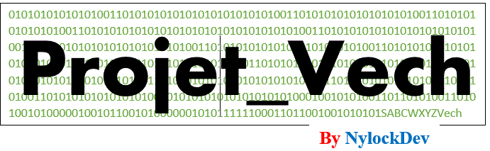

# Vech By NYLOCKDEV 

## Introduction
Le projet Vech est un programme utiliser pour coder une tension suivant la norme de codage revu par l'IUT **la loi de codage G711** et la loi de codage série linéaire ou uniforme tout en calculant les différents grandeurs ( tension quantifié , tension restituée, tension décodé....)
## Publique cible
- les étudiants en réseau informatique et télécommunications **RIT**
- les enseignants
- les spécialistes du domaine des télécoms
- les passionnés de technologie

## INSTALLATION
> Le programme est disponible au format exe

Depuis votre terminal exécuter les commandes

`git clone http:\\github.com/NylockDev/Vech.git`
`python main.py`

